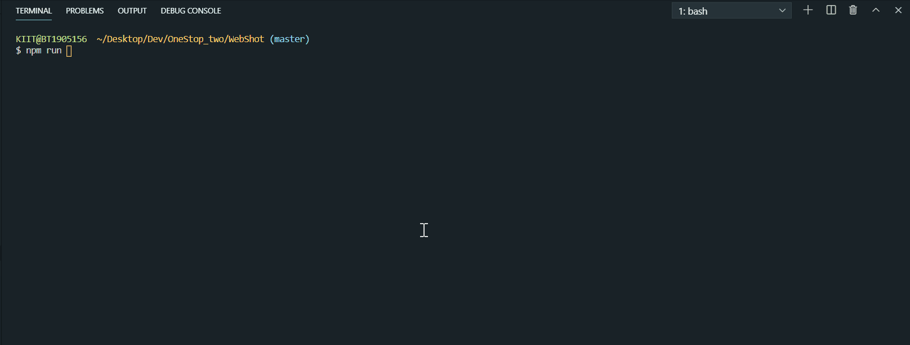

# WebShot

[](https://GitHub.com/Naereen/StrapDown.js/graphs/commit-activity)
[](https://GitHub.com/Naereen/ama)
[](https://code.visualstudio.com/)

A [Nodejs](https://nodejs.org/en/docs/ "Open Node.js docs") command line application that allows user to take automated screenshots of the web and save it locally.

---

## Installation

- **Clone this repo**

  ```
   git clone https://github.com/akashchouhan16/WebShot.git
  ```

- **Install all the dependencies**
  ```
      npm install
  ```
  **OR**
  ```
      npm i --save
  ```
- **Create a `/Output` directory to allow the app to save the image files created.**

- **Run the application**
  ```
      npm run dev
  ```

---

## Preview



**NOTE**

> When the application is provided with no urls, it uses the fallback hard-coded url.

---

## [Application Info](https://github.com/akashchouhan16/WebShot "WebShot")

[](https://forthebadge.com)

### Version

**[1.0.0](https://github.com/akashchouhan16/WebShot "Version")**

### License

**[MIT](https://github.com/akashchouhan16/WebShot/blob/master/LICENSE "MIT LICENSE")**

---
